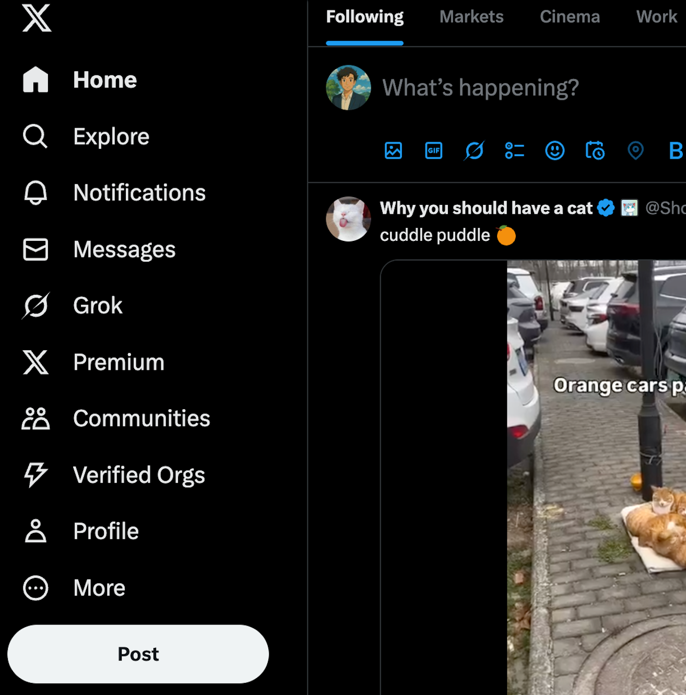

# Hide “For you” on X (Twitter) – Chrome Extension

Removes the **For you** timeline tab and forces X/Twitter to stay on **Following**, so you only see what *you* choose to follow. If you have other manual lists that are pinned, you can navigate to those as well.

## Features
- Hides the "For you" tab after a user-defined countdown (default 10 minutes, customizable per day)
- Live countdown badge on the extension icon
- Clickable extension icon opens a popup overlay
- Set a custom time limit for the day from the popup
- **Analytics tab:** See your "For you" usage for today and this week

## How it works

- When you load X (Twitter), you get a **10-minute window** (per extension install or reload) where the **For you** tab is visible and usable (or your custom limit for the day).
- After the time limit, the extension automatically removes the **For you** tab from the interface and, if you are viewing it, switches you to **Following**.
- The extension uses a timer and stores the start time in Chrome's local storage, so reloading the page does **not** reset the timer, but reloading the extension does.
- The extension icon badge shows a live countdown of how much time is left before **For you** is hidden (in minutes/seconds).
- Click the extension icon to open a popup overlay:
  - **Timer tab:** See the countdown and set a new time limit for the day
  - **Analytics tab:** View your "For you" usage for today and this week
- Even if X/Twitter re-renders the header (which happens frequently), the extension keeps removing the **For you** tab using a MutationObserver, but only after the timer expires.
- After the cutoff, the **For you** tab stays hidden for the rest of the session (or until the extension is reloaded or a new day starts).

## Screenshots

**Extension icon:**


**Timer tab:**


**Analytics tab:**


## Install (unpacked)

1. Clone or download this repo → you’ll have a folder with  
   `manifest.json` · `content.js` · `README.md`.
2. Chrome address bar → `chrome://extensions`.
3. Toggle **Developer mode** (top-right).
4. Click **Load unpacked** → pick this folder.
5. Refresh X/Twitter – the **For you** tab is managed by the extension as described above.

## Updating

1. Edit `content.js` as needed.
2. `chrome://extensions` → hit **Reload** under the extension.
3. Refresh X.

## Packaging (optional)

```bash
zip -r hide-for-you.zip manifest.json content.js README.md
```